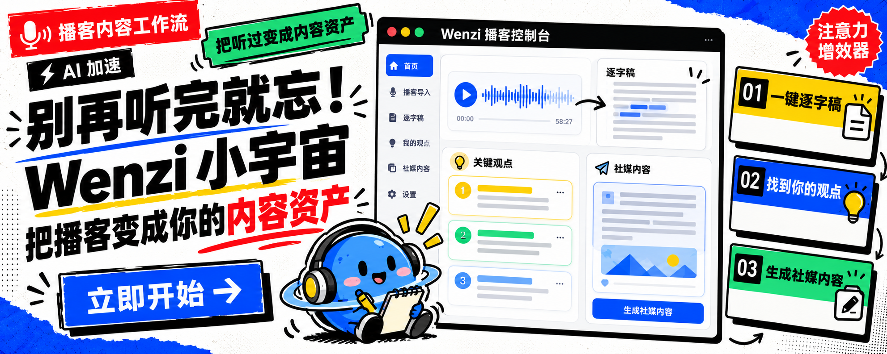
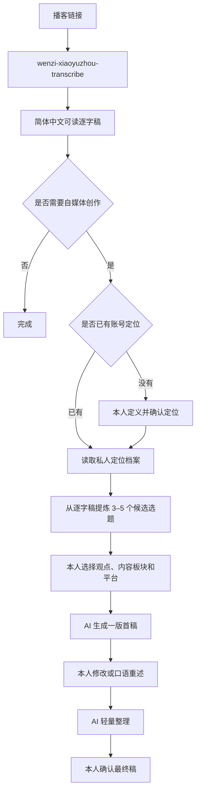
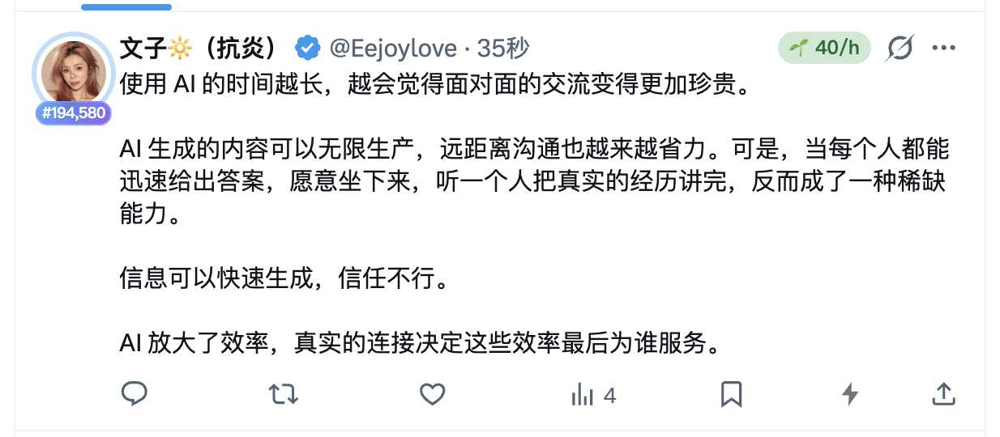

# Wenzi Xiaoyuzhou Workflow



把一条小宇宙或播客链接，变成一份可阅读的简体中文逐字稿；如果你还有自媒体需求，再结合自己的账号定位，从逐字稿中选择观点并生成个性化内容。

这不是一个“把播客批量改写成平台文案”的工具。它把基础转录和个人创作分成两个独立 Skill，让没有创作需求的人停在逐字稿，让需要输出的人保留自己的判断和表达。

## 为什么使用它

现在真正稀缺的已经不是内容，而是时间、注意力和判断力。很多有价值的表达藏在一两个小时的播客里，我们可能想听，却没有足够时间完整听完；听完以后，也很容易只留下模糊印象。

这个工作流不是为了让你消费更多信息，而是帮助你更有选择地处理信息：

1. **节约时间和注意力**：先把播客变成完整、可搜索、可快速阅读的文字稿。你可以判断哪些部分值得细看，不必为了一个观点从头听到尾。
2. **从更多信息中找到真正适合自己的内容**：它不会只做统一摘要，而是结合你已经确认的身份、受众、内容方向和长期关注，筛出与你有关的观点。
3. **持续跟踪你关注的人在表达什么**：当你长期整理同一位主播、嘉宾或创作者的内容，就能看到他的核心观点、反复关注的问题，以及观点随时间发生的变化。
4. **把“听过”变成可以继续使用的个人资料**：逐字稿、来源位置和候选选题被保留下来，一次收听可以继续变成笔记、研究线索、内容选题或个人表达，而不是听完即消失。
5. **减少信息经过转述后的失真**：先保留完整逐字稿和来源，再进行提炼与创作。你随时可以回到原文核验，不必只依赖二手总结。
6. **让 AI 提高效率，但把判断留给自己**：AI 负责转录、整理和提供候选方向；什么值得关注、什么符合你的定位、最后表达什么，仍由你决定。

它最终想解决的不是“如何生成更多内容”，而是：**如何在信息过载中，把有限的注意力留给真正与你有关、值得长期积累的内容。**

## 两个独立 Skill

| Skill | 负责什么 | 最终成果 |
| --- | --- | --- |
| [`wenzi-xiaoyuzhou-transcribe`](skills/wenzi-xiaoyuzhou-transcribe/) | 下载播客、转录、纠错、简繁转换和阅读排版 | 简体、无时间戳、自然分段的完整 Markdown 逐字稿 |
| [`wenzi-xiaoyuzhou-content`](skills/wenzi-xiaoyuzhou-content/) | 确认个人定位、提炼候选观点、生成平台首稿 | 与本人定位匹配，并经过本人判断的社媒内容 |

两个 Skill 可以单独使用，也可以顺序使用。

## 最短使用路径

### 只需要逐字稿

发送播客链接，并输入：

```text
请把这个播客链接整理成完整的 Markdown 逐字稿。
```

最终只交付一份：

- 简体中文；
- 没有逐段时间标注；
- 保留完整口述内容；
- 修正常见同音词和明显识别错误；
- 根据内容添加主题标题；
- 段落有呼吸感，可以直接阅读。

下载、转录、去时间戳、纠错和排版都在后台完成，不要求用户参与中间步骤。

### 继续创作社媒内容

逐字稿完成后输入：

```text
使用 $wenzi-xiaoyuzhou-content，根据我已经确认的账号定位，
从这份逐字稿中筛选 3–5 个候选选题，先不要写正文。
```

用户选择一个方向后，再生成一个平台的首稿。首稿用于帮助本人表达，不被当作最终稿；用户可以直接修改或用口语重新讲一遍自己的意思。

## 完整流程



## 创作环节为什么先建立个人定位

同一段播客内容，对不同的人有不同价值。

一个创业者可能关注商业判断，一个营养师可能关注健康选择，一个 AI 实践者可能关注工作流。Skill 不根据昵称、平台或播客内容猜测用户定位，而是由用户本人确认：

1. 我是谁；
2. 我主要写给谁；
3. 我长期关注哪些内容板块；
4. 我希望读者记住我的哪些能力和观点；
5. 哪些经历和信息不能替我编造或公开。

个人定位保存在公开 Skill 目录之外，不随仓库上传或分享。

## 一次真实测试

测试素材来自一段关于 AI 与真实连接的播客内容。

Skill 先提取候选方向：

> 当合成内容和远距离沟通越来越多，面对面理解一个人、听见真实经历，本身会成为更稀缺的价值。

创作者选择方向后，经过“AI 首稿 → 本人口语重述 → AI 轻量整理”，形成并发布了下面这条内容：



这个案例展示的不是“一键生成”，而是 AI 如何帮助创作者更快说出自己的版本。

## 安装

把两个 Skill 复制到 Codex 的个人 Skill 目录：

```bash
git clone https://github.com/wenziai/wenzi-xiaoyuzhou-workflow.git
cp -R wenzi-xiaoyuzhou-workflow/skills/wenzi-xiaoyuzhou-transcribe ~/.codex/skills/
cp -R wenzi-xiaoyuzhou-workflow/skills/wenzi-xiaoyuzhou-content ~/.codex/skills/
```

安装本地转录依赖：

```bash
cd ~/.codex/skills/wenzi-xiaoyuzhou-transcribe
python3 -m venv .venv
source .venv/bin/activate
python3 -m pip install -r requirements.txt
```

本地音频处理还需要 `ffmpeg`。macOS 可以使用 Homebrew 安装：

```bash
brew install ffmpeg
```

只想使用其中一个 Skill 时，只复制对应目录即可。

## 隐私与边界

- 公开仓库不包含任何用户的账号定位、选题池、逐字稿、音频或私人经历；
- 本地转录是默认方案；实验性云端转录只有用户明确选择后才启用；
- 不把主播或嘉宾的经历写成用户的第一人称经历；
- 不在用户确认前替用户决定账号定位、选题和观点；
- 不在没有明确授权时发布社媒内容；
- 请遵守播客平台条款和原内容版权，只保留创作与核验所需的合理引用。

## 仓库结构

```text
assets/
├── wenzi-xiaoyuzhou-cover.png
└── wenzi-xiaoyuzhou-cover-v2.png
skills/
├── wenzi-xiaoyuzhou-transcribe/
│   ├── SKILL.md
│   ├── requirements.txt
│   └── scripts/
└── wenzi-xiaoyuzhou-content/
    ├── SKILL.md
    ├── agents/
    ├── assets/
    └── references/
```

转录负责把播客变成可阅读资料；内容生成器负责把资料变成属于创作者本人的表达。两层互相连接，但互不强迫。
