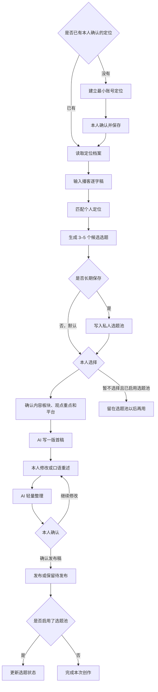

# 从播客逐字稿到你的社媒观点

这个 Skill 是一个自媒体内容辅助工具：它不会把播客简单压缩成摘要，也不会替你批量生产看起来正确、却不像你的内容。

它先从播客逐字稿中寻找与你账号定位匹配的候选选题，再用一版初稿帮助你把观点说出来。你可以修改，也可以直接用口语重新讲一遍，最后由 AI 做轻量整理。

最终发布的不是“AI 对播客的总结”，而是被播客素材触发、经过你本人判断和表达的一条内容。

## 直接从这里开始

先看自己手里已经有什么，只走对应的入口。

### 我只有一个播客链接

先使用 `wenzi-xiaoyuzhou-transcribe` 把链接转成逐字稿。逐字稿完成后，再决定是否进入内容创作，不会自动把整期节目继续加工到底。

可以直接输入：

```text
请先把这个播客链接转成逐字稿。转录完成后先停下来，不要直接生成社媒内容。
```

### 我有逐字稿，但还没有账号定位

可以直接输入：

```text
使用 $wenzi-xiaoyuzhou-content。这是我第一次使用，请先帮助我建立最小账号定位。定位没有经过我确认前，不要分析逐字稿或写正文。
```

### 我已经有账号定位和逐字稿

可以直接输入：

```text
使用 $wenzi-xiaoyuzhou-content。这是我的逐字稿，请根据已经确认的账号定位筛选 3–5 个候选选题，先不要写正文。
```

### 我的选题池里已经有候选内容

可以直接输入：

```text
使用 $wenzi-xiaoyuzhou-content。请读取我的个人选题池，列出适合现在继续创作的候选内容，先让我选择。
```

## 两种使用方式

### 快速创作模式（默认）

适合只想从一份逐字稿完成一条内容的人，不需要建立选题池：

```text
逐字稿 → 候选选题 → 本人选择 → AI 首稿 → 本人表达 → AI 整理 → 发布稿
```

### 长期积累模式（可选）

适合持续经营账号、希望把暂时没有创作的候选内容留下来以后继续使用的人：

```text
逐字稿 → 候选选题 → 私人选题池 → 分批创作 → 更新状态
```

个人选题池不是使用 Skill 的前置条件。只有用户明确希望长期保存时才启用。

## 整条链路



一句话概括：

> 逐字稿 → 匹配定位 → 筛选选题 → 本人选择 → AI 首稿 → 本人表达 → AI 整理 → 本人确认

第一次使用时，前面还会增加一次“建立并确认账号定位”。完成后可以长期复用，不需要每次重新回答。

## 最终会得到什么

这个流程不会只留下一段聊天记录。每个阶段都有明确成果：

| 阶段 | 得到的成果 |
| --- | --- |
| 首次定位 | 一份本人确认、以后可以复用的账号定位档案 |
| 处理逐字稿 | 一组带来源和时间位置的素材片段 |
| 筛选选题 | 3–5 个候选选题；需要长期积累时可选择保存到个人选题池 |
| 确认方向 | 一张包含板块、观点、平台和表达目标的创作卡 |
| 内容创作 | 一版用来回应和修改的 AI 首稿 |
| 本人表达 | 一版保留本人判断和语言的发布稿 |
| 发布之后 | 一份本人确认的发布稿；启用选题池时再更新状态和可选的发布记录 |

一次完整创作不以“AI 写完”为结束。快速模式以形成本人确认的发布稿为结束；长期模式还会更新选题状态。

## 个人选题池（可选）

选题池不是一份临时清单，而是长期积累的内容资产。每个候选选题至少记录：

- 选题名称和一句话观点；
- 来源节目、说话者和时间位置；
- 内容板块、能力信号和观点资产；
- 适合平台和推荐理由；
- 当前状态；
- 草稿或发布稿位置；
- 可选的发布日期、发布链接和复盘。

状态只使用以下几个值，方便下次继续：

```text
待选择 → 已选择 → 创作中 → 待发布 → 已发布
                    ↘ 暂不采用
```

真实选题池属于用户私有内容，默认保存在公开 Skill 目录之外。保存前会先展示内容并征得同意；上传或分享 Skill 时，不会把个人选题一起上传。不需要长期管理内容时，可以完全跳过这一部分。

## 每一步谁来决定

| 环节 | AI 负责 | 你负责 |
| --- | --- | --- |
| 账号定位 | 帮你整理结构 | 定义自己是谁、写给谁、长期讲什么 |
| 素材筛选 | 从逐字稿中找到有依据的片段 | 决定哪些方向与你有关 |
| 选题池 | 标注内容板块、能力信号、观点资产和适合平台 | 选择这次真正想表达的题目 |
| 内容首稿 | 把已确认的方向组织成一版可修改的表达 | 判断它是否像你、观点是否成立 |
| 本人表达 | 接住你的修改或口语输入 | 加入自己的用词、经验、态度和取舍 |
| 轻量整理 | 去重复、顺语序、调节奏、适配平台 | 确认最终版本 |
| 发布 | 默认不代发 | 决定是否发布；如需代发，另行明确授权 |

## 为什么要保留“本人表达回合”

AI 首稿的作用不是替你完成表达，而是给你一个可以回应的对象。

有了首稿之后，你往往更容易判断：

- 哪句话不像自己；
- 哪个判断还不够准确；
- 哪个词应该换成平时会说的方式；
- 还需要加入什么真实经验或立场。

因此，流程不会在 AI 交付首稿时结束。你修改或口语重述之后，AI 只做轻量整理，不会擅自把内容重新写成统一的“AI 味”。

## 一次真实案例

### 1. 从逐字稿中提取方向

候选观点：

> 当合成内容和远距离沟通越来越多，面对面理解一个人、听见真实经历，本身会成为更稀缺的价值。

### 2. 放入个人选题池

- 主内容板块：真实世界与连接
- 关联方向：AI 与工作流
- 内容形式：观点判断
- 希望展现：对 AI 效率与真实信任关系的判断
- 目标平台：X

### 3. AI 提供首稿

首稿先把观点组织成完整结构，让创作者判断它是否成立、是否像自己。

### 4. 本人口语重述

创作者没有直接接受首稿，而是按照自己的说话方式重新表达，再交给 AI 整理。

### 5. 轻量整理后的发布稿

> 使用 AI 的时间越长，越会觉得面对面的交流变得更加珍贵。
>
> AI 生成的内容可以无限生产，远距离沟通也越来越省力。可是，当每个人都能迅速给出答案，愿意坐下来，听一个人把真实的经历讲完，反而成了一种稀缺能力。
>
> 信息可以快速生成，信任不行。
>
> AI 放大了效率，真实的连接决定这些效率最后为谁服务。

### 6. 实际发布


## 使用前需要准备什么

首次使用时，需要先由本人确认一份最小账号定位：

1. 我是谁；
2. 我主要写给谁；
3. 我长期关注哪些内容板块；
4. 我希望读者记住我的哪些能力和观点；
5. 哪些经历、信息或说法不能替我编造。

定位确认后，以后处理新的播客逐字稿可以直接复用，不需要每次重新访谈。

## 怎样算完成

无论使用哪种模式，都需要满足：

- 选题来源可以追溯；
- 选题与本人的账号定位有关；
- 本人已经选择内容板块、观点重点和目标平台；
- 本人修改、补充或明确认可了表达；
- 已形成可发布的最终稿；

如果启用了长期积累模式，还需要满足：

- 候选选题已经写入用户自己的私人选题池；
- 选题状态已经更新为 `待发布`、`已发布` 或 `暂不采用`。

如果只完成逐字稿、候选选题或 AI 首稿，应明确标为阶段成果，不假装整条链路已经完成。

## 这个 Skill 不做什么

- 不负责下载或转录播客；它接收已经完成的逐字稿或观点素材。
- 不把主播或嘉宾的经历写成你的第一人称经历。
- 不在你确认之前替你决定账号定位、选题和观点。
- 不一次性把所有候选选题全部加工成多平台内容。
- 不在没有明确授权时替你发布。

它要简化的是内容创作流程，而不是拿走创作者本人的判断和表达。
